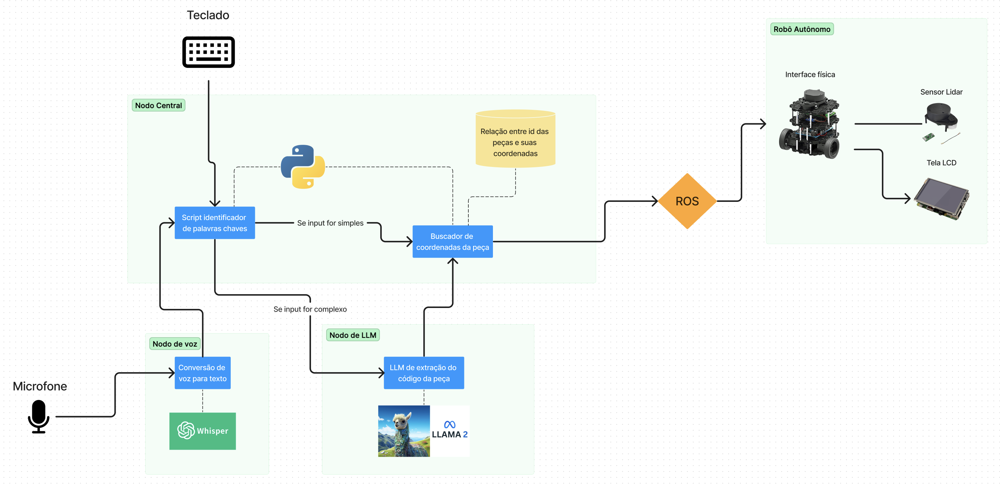

# Arquitetura do Sistema

## Resumo:

O sistema consiste em uma arquitetura baseada em ROS que integra um Nodo Central com módulos de processamento de voz e texto a um Robô Autônomo. O objetivo é permitir que o robô interprete e execute comandos relacionados à busca de peças em um ambiente, utilizando tanto entradas de teclado quanto comandos de voz.

## Componentes:

1. **Nodo Central**:
    - **Script identificador de palavras-chaves**: Este script é responsável por determinar a natureza do comando, seja ele simples ou complexo. Os comandos podem ser inseridos através do teclado ou por voz.

    - **Buscador de coordenadas da peça**: Depois que um comando é interpretado, este módulo busca no banco de dados a localização exata da peça solicitada.

2. **Nodo de voz**:
    - **Conversão de voz para texto (Speech-to-Text)**: Este módulo, utilizando o Whisper, é responsável por converter os comandos de voz do usuário em texto para que possam ser processados pelo sistema.

3. **Nodo de LLM**:
    - **LLM de extração do código da peça**: Após a identificação do comando, se for complexo, o LLM (representado pelo Llama 2) é usado para extrair informações mais detalhadas do texto fornecido, como o código específico de uma peça.

4. **Robô Autônomo**:
    - **Interface física**: Constitui o corpo do robô, permitindo que ele se mova pelo ambiente.
    
    - **Sensor Lidar**: Sensor responsável pelo mapeamento do ambiente e detecção de obstáculos.
    
    - **Tela LCD**: Fornece feedback visual ao usuário, mostrando informações como status atual, comandos recebidos, entre outros.

## Fluxo:

1. O usuário insere um comando através do **teclado** ou **microfone**.
   
2. O comando é enviado ao Nodo Central onde é determinado se é um comando **simples** ou **complexo**.

3. Se o comando for **simples**, o **Buscador de coordenadas da peça** procura diretamente no banco de dados a localização da peça.

4. Se o comando for **complexo**, o **Nodo de LLM** processa o texto para extrair informações detalhadas, como o código da peça.

5. Uma vez obtida a localização da peça, as coordenadas são enviadas ao **Robô Autônomo** através do **ROS**.

6. O Robô Autônomo se move para a localização fornecida e realiza a tarefa designada.

# REQUISITOS FUNCIONAIS E NÃO FUNCIONAIS

Para garantir que o projeto atende às necessidades do cliente especificada em entrevista de levantamento de requisitos em sala de aula, os requisitos foram divisidos em requisitos de hardware e software. Tal divisão se deu pela característica multitécnica do projeto, que envolve componentes de software e hardware, na figura de um artefato robótico. Dentre os requisitos de hardware e software, esses foram classificados entre funcionais (descrição do requisito) e não funcionais (qual é métrica de desempenho que cada requisito funcional deve atingir). Além disso, cada um dos requisitos foi classificado como "obrigatório" ou "desejável", o que auxiliará a equipe de desenvolvimento a estabelecer uma hierarquia de prioridades para sua implementação.

## Requisitos funcionais de software

| ID  | DESCRIÇÃO                                                                                  | CATEGORIA  |
|-----|---------------------------------------------------------------------------------------------|------------|
| RFS1| O sistema deve traduzir voz em texto mediante “wake up world” ou acionamento via interface.  | Obrigatório|
| RFS2| O modelo de linguagem natural implementado deve ser capaz de compreender qual componente e sua quantidade que usuário deseja. | Obrigatório|
| RFS3| O sistema também deve ser capaz de receber comandos via texto.                                | Obrigatório|
| RFS4| O sistema deve ser capaz de avaliar se o input de texto deve passar pelo LLM ou se possui instruções diretas, que serão extraídas com script de processamento de texto mais simples. | Obrigatório|
| RFS5| O sistema deve ser capaz de exibir o número de componentes disponíveis no estoque uma vez identificado. | Obrigatório|
| RFS6| O sistema deve ser capaz de armazenar as coordenadas de todos os componentes que podem ser solicitados. | Obrigatório|
| RFS7| O sistema deve ser capaz de mapear o ambiente no qual o robô irá navegar.                       | Obrigatório|
| RFS8| O sistema deve ser capaz de guiar o robô até as coordenadas do item solicitado.                | Obrigatório|
| RFS9| O sistema deve ser capaz de modificar a quantidade de itens disponíveis uma vez que este for retirado do estoque. | Desejável  |
| RFS10| O sistema deve ser capaz de retornar o robô para seu ponto de origem.                         | Obrigatório|
| RFS11| O sistema deve ser capaz de exibir uma animação de face antropomórfica na tela presente no robô. | Desejável|
| RFS12| O sistema deve ser capaz de exibir a foto da peça solicitada tanto na tela presente no robô quanto no mecanismo de busca. | Desejável|

## Requisitos funcionais de hardware

| ID  | DESCRIÇÃO                                                                                                   | CATEGORIA   |
|-----|--------------------------------------------------------------------------------------------------------------|-------------|
| RFH1| O robô deve ser alimentado por bateria recarregável.                                                          | Obrigatório |
| RFH2| O robô deve ser capaz de se movimentar para frente, para trás e rotacionar no sentido horário e anti-horário. | Obrigatório |
| RFH3| O robô deve possuir um sensor capaz de mapear seus arredores, bem como detectar obstáculos.                   | Obrigatório |
| RFH4| O robô deve possuir um monitor capaz de exibir informações úteis para o processo que irá desempenhar.          | Obrigatório |
| RFH5| O computador do operador do sistema deve ter entrada de áudio capaz de capturar sua voz, para a modalidade comandada por voz do sistema. | Obrigatório |
| RFH6| O robô deve possuir acesso à internet por meio de tecnologia Wifi.                                           | Obrigatório |
