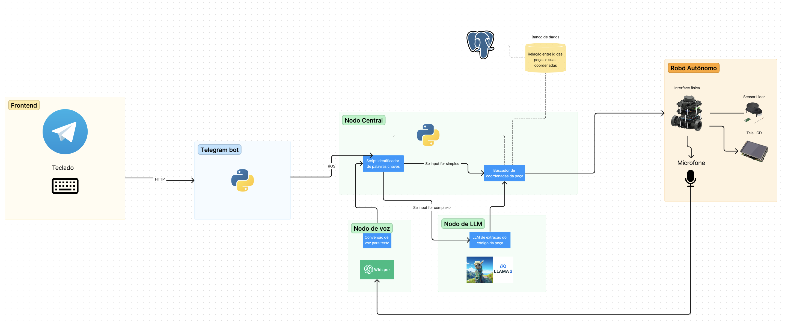

# ARQUITETURA DO SISTEMA 

### Visão Geral
O sistema consiste em uma arquitetura baseada em ROS que integra um Nodo Central com módulos de processamento de voz e texto a um Robô Autônomo. O objetivo é permitir que o robô interprete e execute comandos relacionados à busca de peças em um ambiente, utilizando tanto entradas de teclado quanto comandos de voz.

O sistema é composto por uma estrutura frontend-backend, integrada a um sistema robótico autônomo. O frontend foi construído usando Next.js, e a comunicação com o backend ocorre via API. No núcleo do sistema, temos um Nodo Central que gerencia a entrada de dados e direciona para os respectivos componentes. Uma parte crucial é o Robô Autônomo, que possui vários periféricos, incluindo um microfone, um sensor Lidar e uma tela LCD.

### Componentes do Sistema

1. **Frontend: Telegram**
   - Input: Teclado
   - Comunicação: HTTP para Bot do Telegram

2. **Bot do Telegram**
   - Serve como ponte entre o frontend e o Nodo Central.

3. **Nodo Central**
   - Responsável pela lógica principal e pelo gerenciamento dos nodos auxiliares.
   - Integração com o banco de dados para recuperar a relação entre IDs de peças e suas coordenadas.
   - Contém um script identificador de palavras-chave para determinar o tipo de entrada (simples ou complexa).

4. **Nodo de voz**
   - Conversão de voz para texto usando o serviço Whisper.

5. **Nodo de LLM**
   - LLM para extração do código da peça.
   - Imagem representativa: Llama

6. **Robô Autônomo**
   - Interface física: Sensor Lidar, Tela LCD, Microfone.
   - Busca coordenadas das peças com base nos inputs.

### Fluxo de Dados

1. O usuário insere dados via teclado no frontend Next.js ou através da voz no microfone do Robô Autônomo.
2. O input é enviado à API.
3. O Nodo Central avalia a entrada, e, se for simples, procura as coordenadas diretamente no banco de dados. Se for uma entrada complexa, direciona para o Nodo de LLM para processamento adicional.
4. O Robô Autônomo busca a peça com base nas coordenadas obtidas e exibe informações na Tela LCD.
