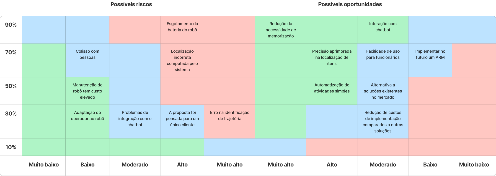

# Matriz de Risco

A matriz de risco é primordial para elencar os pontos que merecem mais atenção no projeto e sua probabilidade de acontecer. 
Assim, riscos e oportunidades são apresentados na imagem abaixo.

## Riscos
Nesta etapa, será elencado em mais detalhes os pontos de risco que estão na matriz.

## Oportunidades
Nesta etapa, será elencado em maior profundidade as oportunidades que o projeto oferece. 