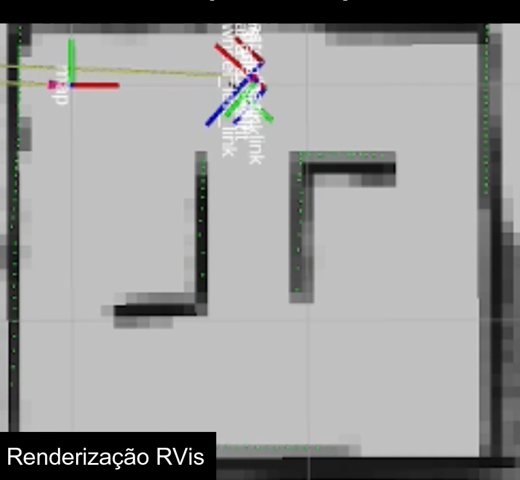

## Mapeamento do ambiente 

#### Introdução
Saber onde se está é uma necessidade essencial do ser humano e primordial para um robô que visa buscar peças. Assim, para o TurtleBot 3 é utilizado o sistema de mapeamento Nav2 (Navigator 2) que recebe as informações da camera infravermelho . 
Assim, a camera do robô fica girando constantemente e emitindo um feixe infravermelho que retorna ao sensor e assim é possível formar uma imagem em 360º do ambiente. 

#### Mapeamento 
Para o robô entender onde o mesmo está localizado e realizar a navegação até determinado ponto do mapa são necessários alguns passos. Considerando que as configurações do robô já estejam prontas, isto é com sistema operacional instalado, conectado a internet e com as bibliotecas instaladas. 
Assim, para mapear o ambiente, é utilizano o software gazebo, de tal modo que é possível movimentar o robô por toda a área a ser mapeada. O resultado deste mapeamento pode ser observado na imagem abaixo. 

Após o mapa do ambiente estar salvo é possível definir diferentes pontos no mapa e o robô pode navegar até esses pontos como no exemplo abaixo. 

[Mapeamento e navegação](https://youtu.be/raEjiScBLww)