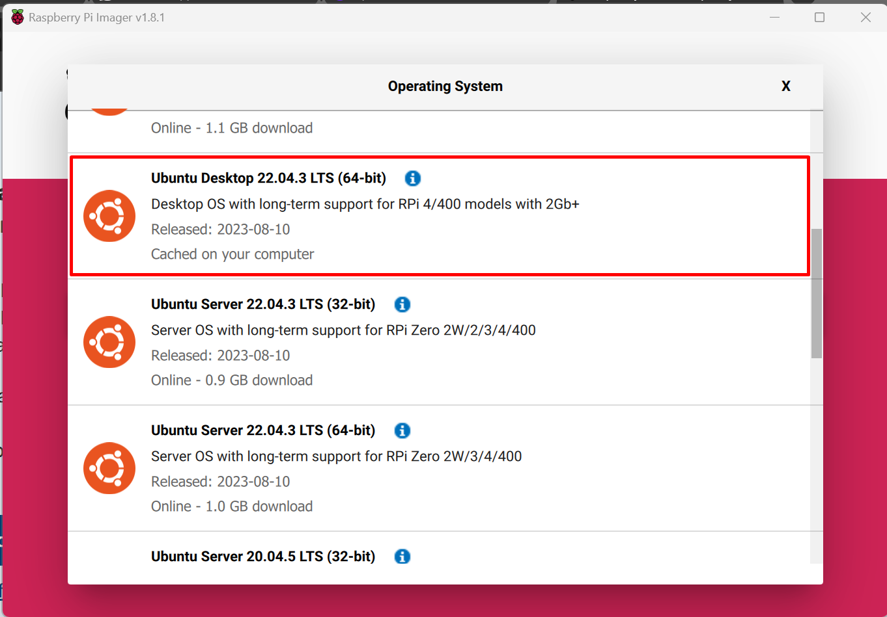

# Setup do robô

#### Introdução

Para o desenvolvimento das rotinas de mapeamento, navegação, e demais aplicações envolvendo o robô Turtle Bot 3 Burger, foi necessário configurá-lo de modo a facilitar a manipulação de arquivos, pacotes, bem como a edição de arquivos de texto. Por não contar com periféricos nativos como mouse e teclado, recursos de acesso remoto foram instalados.

#### Sistema Operacional

O dispositivo Turtle Bot 3 Burguer conta com um single board computer Raspberry Pi 4. O processo de configuração de seu sistema operacional seguiu as recomendações do fabricante, utilizando seu gravador de cartões SD Raspberry Pi Imager (https://www.raspberrypi.com/software/). Nesta interface, foi escolhida a opção de sistema operacional Ubuntu desktop 22.04 LTS Server. Tal opção foi feita levando em conta a estabilidade e suporte de longo prazo que o Ubuntu LTS garantem um ambiente operacional confiável ao longo do tempo, enquanto a comunidade ativa e vasta gama de recursos online facilitam o desenvolvimento. 


A versão com interfce grágica do Ubuntu foi escolhida poias simplifica a configuração e monitoramento do sistema, tornando o processo mais intuitivo. Além disso, o ecossistema de software diversificado e a compatibilidade otimizada com o Raspberry Pi 4 maximizam o desempenho e a eficiência do robô, oferecendo uma base sólida para a implementação de algoritmos avançados de navegação e controle.

#### Acesso remoto

Dado que o dispositivo não possui periféricos de entrada usuais, como teclado e mouse, recursos de acesso remoto foram instalados para que o desenvolvimento pudesse ser realizado de forma eficiente a partir dos notebooks dos desenvolvedores. A implementação de configurações VNC (Virtual Network Computing) e SSH (Secure Shell) desempenhou um papel crucial nesse cenário.


```

```


O VNC possibilitou o acesso remoto à interface gráfica do sistema, permitindo uma visualização interativa das operações do robô por meio dos notebooks. Essa funcionalidade é particularmente valiosa ao empregar ferramentas visuais como o RViz no contexto do Robot Operating System (ROS), no caso de testes preliminares feitos com sua interface gráfica sendo executada no Raspberry Pi. Tal rotina foi abandonada a fim de deixar a unidade computacional embarcada no robô apenas com a tarefa de coletar as informações por meio do LIDAR e transmití-las para o comptutador dos desenvolvedores, onde a imagem dos mapas eram geradas.

A configuração SSH também ofereceu a capacidade de executar comandos e scripts remotamente, simplificando a configuração e manutenção do sistema para desenvolvedores que possuam maior fluência com a interação por meio de terminal de comando em um sistema Linux. 

Assim, essa combinação de recursos de acesso remoto proporcionou aos desenvolvedores do projeto uma abordagem flexível e conveniente para o desenvolvimento e controle do Turtle Bot 3 Burguer, independentemente da presença de periféricos locais e de proximidade física.


 O sistema operacional Ubuntu desktop 22.04 lts server foi instalado no SBC Raspberry Pi 4. Para possibilitar a configuração remota do dispositivo, as conexões por SSH e servidor VNC também foram realizadas.
